<div align="center">

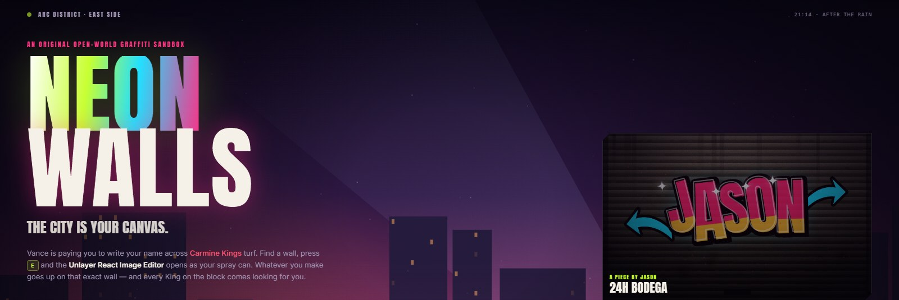

**A GTA-inspired open-world graffiti game where the
[Unlayer React Image Editor](https://github.com/unlayer/react-image-editor) *is* the spray can.**

Built for the *Build with React Image Editor* challenge.


### [►&nbsp; PLAY IT IN YOUR BROWSER](https://liebyzz.github.io/contest-unlayer-gta/)

<sub>No install. Desktop, keyboard and mouse.</sub>

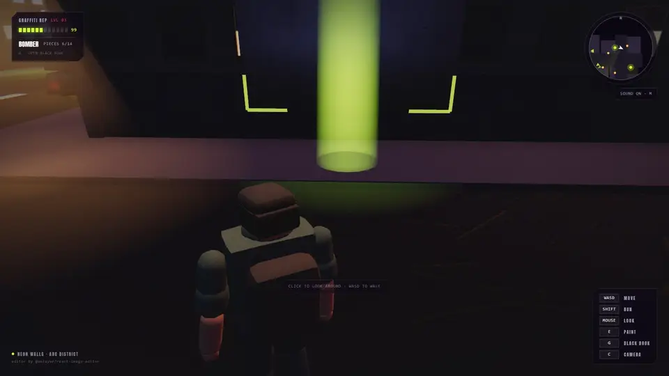

<sub>One full loop, unedited gameplay: find a wall → press <kbd>E</kbd> → make it in the Unlayer editor → <b>PAINT THE WALL</b> → the wall replays how you made it → the street notices.</sub>

[Play now](https://liebyzz.github.io/contest-unlayer-gta/) ·
[Quick start](#quick-start) ·
[The Graffiti Studio](#the-graffiti-studio) ·
[How the editor is wired in](#how-the-editor-is-wired-in) ·
[Features](#what-else-is-in-the-city) ·
[Controls](#controls) ·
[Under the hood](#under-the-hood)

</div>

---

## The idea in one line

You walk a neon-lit city block, find a wall and press <kbd>E</kbd>, and
[`@unlayer/react-image-editor`](https://github.com/unlayer/react-image-editor) opens as a
full-screen game mode, the **GRAFFITI STUDIO**. Whatever you make in it is sprayed onto that exact
surface in the 3D world and stays there.

> The editor isn't bolted onto a demo. It's the only way to make anything in this game.

<table>
  <tr>
    <td width="33%">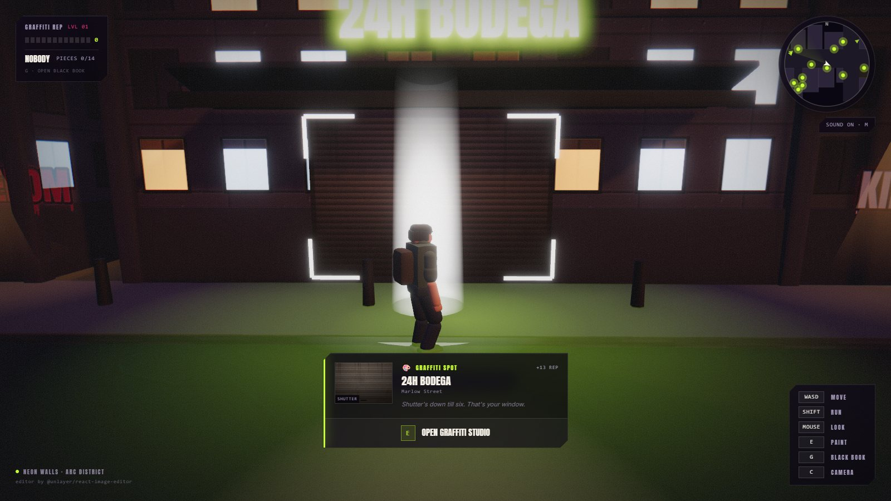</td>
    <td width="33%">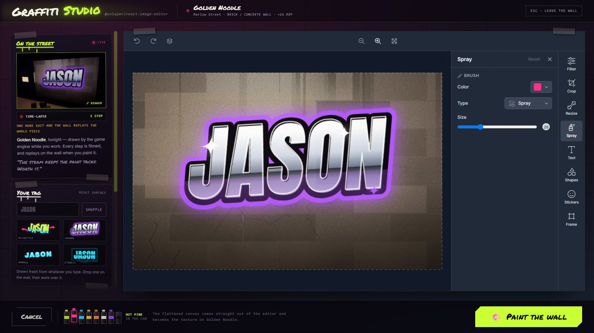</td>
    <td width="33%">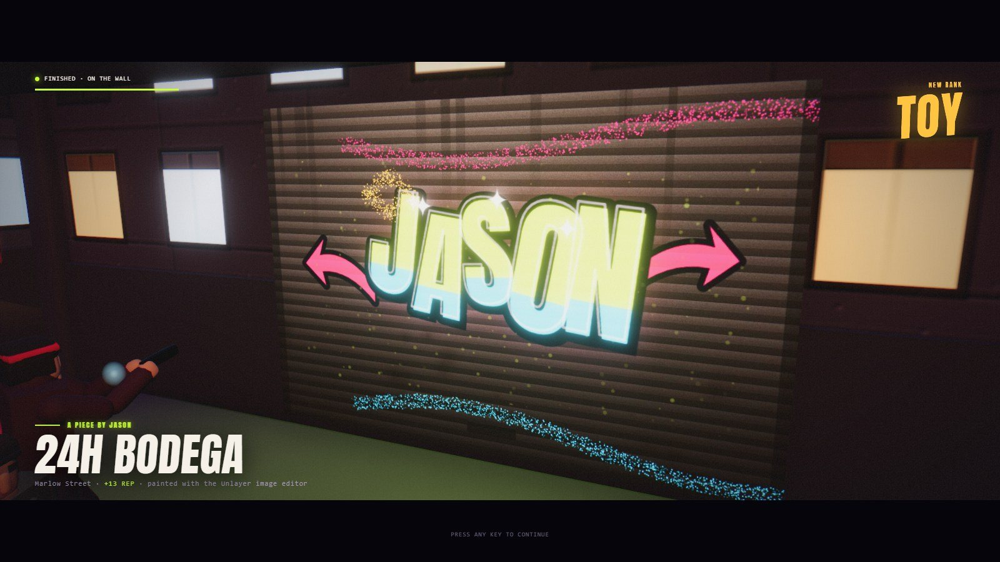</td>
  </tr>
  <tr>
    <td align="center"><b>01 · Find a wall</b><br><sub>Fourteen spots on Carmine turf</sub></td>
    <td align="center"><b>02 · Open the studio</b><br><sub>Unlayer's editor, in-game</sub></td>
    <td align="center"><b>03 · Paint the city</b><br><sub>Replayed on the wall, step by step</sub></td>
  </tr>
</table>

## Quick start

**Play it live at <https://liebyzz.github.io/contest-unlayer-gta/>**, or run it locally:

```bash
npm install
npm run dev
```

Open <http://localhost:3000>, type your tag, pick **STORY** or **FREE PAINT** and press **ENTER CITY**.
Best on a desktop with a keyboard and mouse.

---

## The Graffiti Studio

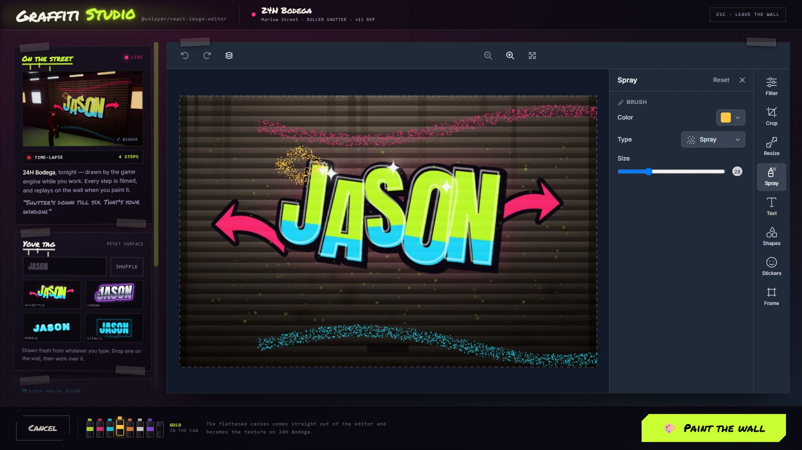

The studio is the Unlayer editor dressed as a game mode. Everything on screen either feeds the editor
or comes out of it.

| | |
|---|---|
| **ON THE STREET · LIVE** | That wall, rendered by the game engine with your work in progress on it. Updates every time your hand comes to rest. |
| **TIME-LAPSE** | Every settled canvas is filmed. The counter ticks up as you work, and the wall replays the film when you paint it. |
| **YOUR TAG** | Your name drawn fresh in four hands — **WILDSTYLE**, **CHROME**, **BUBBLE**, **STENCIL** — ready to drop on the wall and work over. **SHUFFLE** re-rolls the colours. |
| **IMPORT AN IMAGE** | A picture from your machine, blended into the surface, then handed to the editor to crop, filter and draw over. |
| **YOUR PHOTOS** | Every shot from the in-game phone camera, one click from the wall. |
| **THE RACK** | Eight cans in the city's colours. Clicking one opens **Spray** and loads that colour into the editor's brush, so the can in the tray and the brush on the canvas are the same object. |
| **The editor's rail** | Filter, crop, resize, spray, text, shapes, stickers, frame. All of it is live and all of it ends up on the wall. |

### Same pixels in, same pixels out

Every paintable surface has a **procedurally generated photograph of itself**: brick, corrugated
shutter, paste-up billboard, plywood hoarding, a van's flank. It's drawn on a 2D canvas at runtime
(`lib/graffiti/surfaces.ts`).

That same data URL is used for **both** the texture on the wall in three.js **and** the `image`
prop handed to `<ImageEditor>`. The editor opens on the literal pixels you were just looking at.
When you hit **PAINT THE WALL**, the flattened canvas comes back out (`editor.getImage()`), becomes
a `THREE.Texture` and lands on the wall. It registers perfectly instead of looking like a sticker,
with **no CORS problems and no image assets to host**.

A crop, a resize or a quarter turn can change the piece's shape; the wall stays the shape it is.
`fitToSurface()` hangs a mismatched piece on the bare surface at its own proportions rather than
stretching it, so a square crop on a 2:1 shutter still reads as the lettering you drew.

### Watch it land while you work

The studio is full-screen and the city behind it is stopped, which suits the editor and not the
piece: you're making something for a wall at night, under a sodium lamp, seen from the pavement.

So whenever the canvas may have changed and the hand has been still for a moment, the studio calls
`editor.getImage()` and fits the result exactly as **PAINT THE WALL** would. It then asks the
renderer for **one frame** of that wall from where the reveal camera will stand, through the whole
post-processing stack. Click it for the big version; it keeps updating.

Nothing else renders while the studio is up: the canvas drops to R3F's `frameloop="demand"`
(`lib/game/wallPreview.ts`, `components/game/WallPreviewRig.tsx`). It never reads the canvas
mid-gesture, so typing in a text layer or dragging a brush is untouched.

### Every step is filmed

Each time the canvas settles, whether it's the bare shutter, the tag dropped on it, a stroke of
spray, a text layer or a filter, a small JPEG of it joins a queue (`lib/graffiti/timelapse.ts`).
That film is used four times:

- **On the wall.** The piece doesn't just spray on. The wall replays how it was made, a hiss of can
  on each step, with `TIME-LAPSE · 5 STEPS IN THE EDITOR` in the letterbox, then lands with a flare.
- **In the black book**, as a flipbook that loops, pauses on a click and jumps to any step.
- **As a video.** **SAVE THE TIME-LAPSE · VIDEO** films the flipbook onto a 1280×720 canvas (title
  card, every step, a stamp, the street photograph to close) through `MediaRecorder`. It saves MP4
  where the browser can and WebM where it can't. Made locally, ready to post.
- **On the city tour**, every wall replays its film as the camera touches down.

### How the editor is wired in

Every integration point with `@unlayer/react-image-editor`, and what the game does with it:

| Editor API | In the game |
|---|---|
| `image` prop | The procedurally drawn photograph of the surface, the same data URL as the wall texture |
| `editor.getImage()` | The texture that goes on the wall, the live street preview and every time-lapse frame |
| `editor.reset(image)` | Drops a tag, an imported picture or a phone photo onto the surface as a fresh base |
| `editor.hasChanges()` | Guards every way out of the studio. Walking away from an unpainted piece asks first |
| `onSave({ dataUrl })` | The toolbar's save is wired to the same `paint()` as the studio's own button |
| `onLoad` / `onError` | Ready state, plus a graceful fallback (import or a ready-made piece) if the CDN is unreachable |
| `translations` | The editor speaks the game's language: Draw is **Spray**, save/cancel read **Paint the wall** / **Leave** |
| `features.imageEditor.tools.draw.icon` | The pencil is replaced by a spray can drawn in raw SVG |
| `theme: "dark"` | Matches the night-time city |
| `data-testid` hooks | Spray opens pre-loaded with the editor's spray brush at a wide nozzle, in the rack's colour instead of a near-invisible red |

```tsx
const EDITOR_OPTIONS: ImageEditorOptions = {
  theme: "dark",
  features: { imageEditor: { tools: { draw: { icon: SPRAY_CAN_ICON } } } },
  translations: {
    en: {
      "image_editor.toolbar.save": "Paint the wall",
      "image_editor.toolbar.cancel": "Leave",
      "image_editor.tools.draw": "Spray",
    },
  },
};

<ImageEditor
  ref={editorRef}
  image={initialImage}              // the wall's own photograph
  options={EDITOR_OPTIONS}
  onLoad={() => setReady(true)}
  onError={() => setFailed(true)}
  onSave={({ dataUrl }) => void paint(dataUrl)}
/>
```

<details>
<summary><b>Small touches in the studio</b></summary>

- **One call to action.** Teaching the toolbar the game's words left *Paint the wall* on screen twice,
  forty centimetres apart. A small hook marks the toolbar's save/cancel by the labels the
  translations put there, and one CSS rule hides them. The toolbar keeps undo, redo, layers and
  zoom; the footer keeps the one neon button. If a future editor stops carrying those labels, both
  routes still work.
- **Esc belongs to the editor first**: finishing a text layer or closing a colour picker. It only
  asks to leave when the editor didn't use it.
- **No empty reveals.** **PAINT THE WALL** on a surface nobody has touched used to put up the bare
  wall. Now the studio says the wall is still bare and lights up the tag card instead.
- **Laptop screens.** On a short screen the rail drops its explanatory paragraphs so all four tags
  sit above the fold.
- **No loading spinner.** The editor bundle is fetched from Unlayer's CDN while the briefing plays
  (`lib/graffiti/editorWarmup.ts`). With the cache off, the first press of <kbd>E</kbd> takes about a
  third of a second from key to canvas.

</details>

---

## The reveal

<table>
  <tr>
    <td width="50%"></td>
    <td width="50%">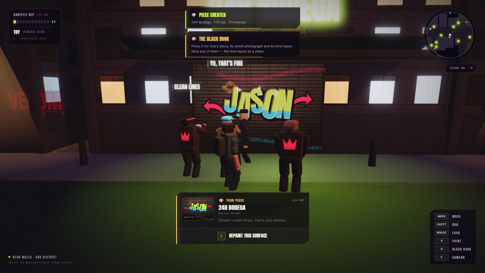</td>
  </tr>
</table>

- **The paint lands the way paint does.** It mists on from the bottom of the wall through a speckled
  aerosol front, then the piece flares with its own emissive spike, so the flash is exactly the
  shape of the work.
- **A new rank gets stamped on the reveal**: TOY → WRITER → BOMBER → KING KILLER → ALL CITY →
  STREET KING.
- **The street notices.** The nearest passers-by stop, turn, hurry over and get their phones out:
  screens glowing, flashes going off, a couple of them saying what they think. If nobody can see
  that wall, someone comes round the corner.
- **Every piece is photographed where it stands.** Three seconds in, the game photographs the wall
  out of the live renderer, with the sodium lamps, fog, ambient occlusion and grade. The flat
  canvas is the *artwork*; this is the picture of the *work*.
- **The shot is looked after.** Lamp posts and parked cars between the lens and the piece step out of
  frame for the reveal (`RevealClearance.tsx`, a box-against-pyramid test). People never do: they're
  the best thing in the photo. The writer steps aside, their carried light dims so it doesn't burn a
  hotspot into the art, and the markers for walls still to paint go out.

---

## What else is in the city

### The black book

Press <kbd>G</kbd> any time for everything you've put up. Each piece opens as **IN THE STREET**,
**THE ARTWORK**, **BEFORE / AFTER** (a draggable slider over the bare wall) or **TIME-LAPSE**.

<table>
  <tr>
    <td width="58%">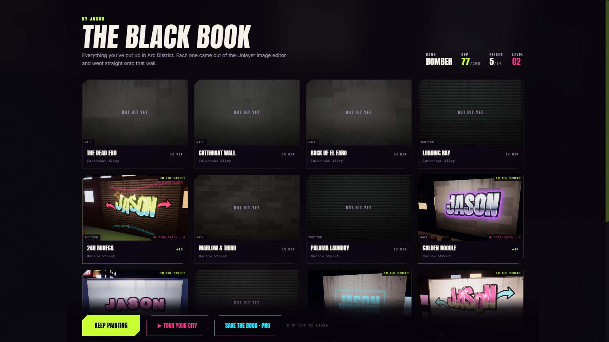</td>
    <td width="42%">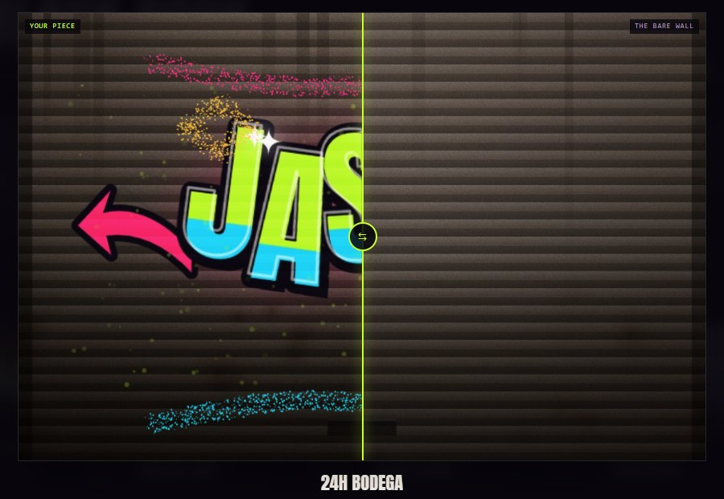</td>
  </tr>
</table>

And you can keep it all. Everything is drawn locally and handed straight to the browser; nothing is
uploaded.

- **DOWNLOAD PNG**: the exact artwork, the same pixels that are on the wall.
- **COPY IMAGE**: whichever face you're looking at, to the clipboard.
- **SAVE THE TIME-LAPSE · VIDEO**: the piece being made, as MP4/WebM.
- **SAVE THE BOOK · PNG**: the whole session as one contact sheet, under your rank and reputation.

### The city tour

Once two walls are up, the black book offers **TOUR YOUR CITY**. The camera climbs over the roofs
and flies the block (`lib/game/tour.ts`). It drops onto each wall at the reveal's own framing while
the wall replays its time-lapse, pins the flat artwork beside the street view, and closes on an
aerial of the district with a four-bar synthwave loop synthesised on the audio clock. Painting the
fourteenth wall plays it as the **VICTORY LAP**.

<p align="center">
  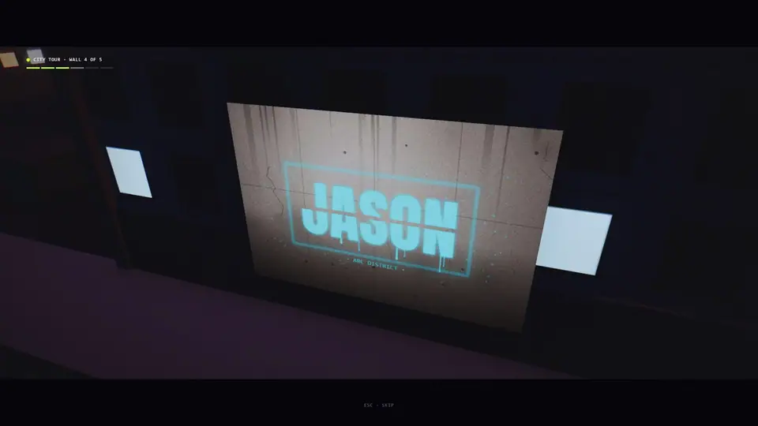
</p>

<details>
<summary><b>How the flight is built</b></summary>

The flight is three overlapping moves rather than one curve. A Bézier with its handles over each end
cut corners: it was travelling sideways a third of the way up, and every reveal shot has a wall
behind the lens. Here the climb is mostly done before the camera starts to cross. Cruising height is
the tallest roof under the line plus a margin, so a hop between two walls in the same alley stays
low. The descent begins once it's across.

A tour visits at most six walls, chosen for the work in them (the longest time-lapses, the biggest
surfaces, always the newest) and chained nearest-first from where you stand. It ends on the newest
piece before the camera pulls out over the block. The time-lapse frames start decoding while the
camera is still in the air.

</details>

### The city is also your source material

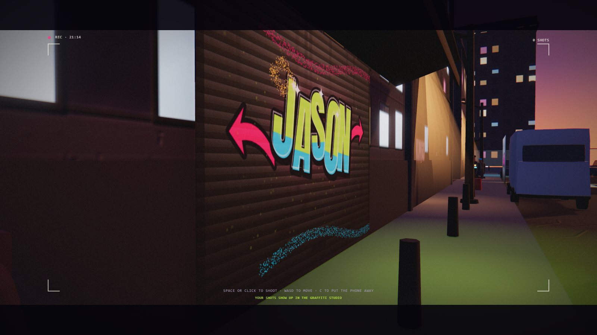

Press <kbd>C</kbd> and the phone comes out: first person, a viewfinder, full control while you frame
the shot. <kbd>Space</kbd> takes it. The capture is the renderer's own canvas *after*
post-processing, so the photo keeps the bloom, grade and ambient occlusion, and the HUD (DOM) never
touches it. Every shot lands in the studio under **YOUR PHOTOS**. Photograph the sunset down Marlow
Street, crop it in the Unlayer editor, letter over it and spray the result onto a shop shutter.

### Your tag, your city

- **YOUR TAG** on the menu is the name you write under. Vance opens the briefing with it, the studio
  draws it in four styles, the reveal signs the piece with it and the black book is *by* it.
- **Your city is kept.** Every piece, its street photograph, every phone shot and your tag are saved
  in IndexedDB and restored next time. There's a two-step **START OVER** on the menu.

---

## Two ways to play

| **STORY** | **FREE PAINT** |
|---|---|
| Vance is paying you to write your name across **Carmine Kings** turf. Every piece you put up brings them out of the doorways. | The same block, the same traffic, the same crowd, and nobody draws on you. No pistol, no heat: fourteen walls, a backpack of cans and an image editor. |

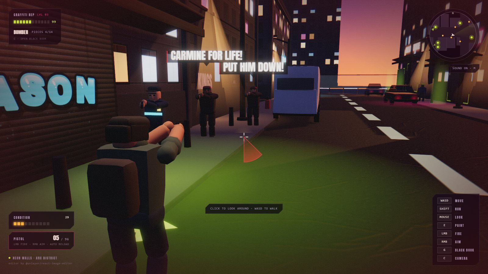

In STORY, the Kings within earshot shout, then come for you. Pull a gun and the police escalate one
star at a time:

| Stars | Response |
| ----- | -------- |
| ★ | A beat cop walking your way |
| ★★ | Two units, called in |
| ★★★ | Citywide: officers from every corner |
| ★★★★ | Tactical officers, and they shoot straight |
| ★★★★★ | Manhunt |

<details>
<summary><b>Why the combat is tuned the way it is</b></summary>

- **Only the nearest three shoot at once** (four at ★★★, five at ★★★★★); the rest close in. Ten
  shooters at a one-second cadence measured out at eight seconds to a WASTED card, with nothing you
  could do about it. Capped, standing in the open kills you in about twenty-five seconds, and the
  answer is to *move*.
- **A grace period after every piece.** You're walking back out of a full-screen editor. The HUD says
  **THE KINGS SAW THAT · RUN** with a draining bar: three seconds, six the first time. It only counts
  down once you have the controls back.
- **Aim assist that can't hit bystanders.** Holding right mouse bends the shot onto whoever is
  nearest the crosshair inside a three-degree cone, and only onto someone armed.
- **Heat is officers on foot and nothing more.** Convoys, air support and armour got built and cut:
  on a block this size they turned a graffiti game into noise.
- Reach zero health and you get a **WASTED** card and respawn. Your pieces stay up. They always do.

</details>

## The briefing

**ENTER CITY** plays an ~18-second opening, skippable with <kbd>Esc</kbd>. Vance calls Jason with the
job, and the one shot that shows the mechanic, **YOUR CAN**, is a drawn mock of the real studio,
down to its tool rail, its footer and a can writing *your* tag.

<table>
  <tr>
    <td width="50%">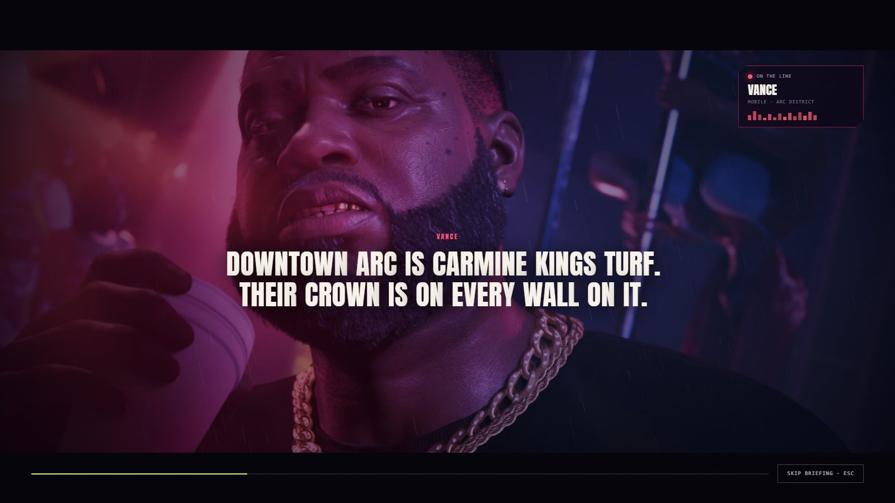</td>
    <td width="50%">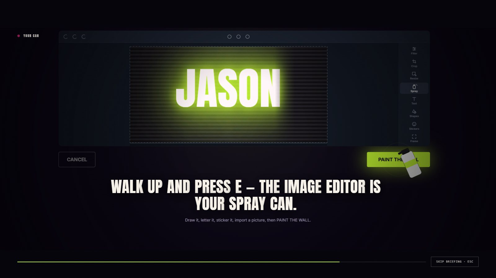</td>
  </tr>
</table>

The phone rings for a second and a half before anyone speaks, and that beat is doing a job. The city
is mounted behind the briefing on `frameloop="demand"`, and its first frames (scene graph, shaders,
texture uploads) are spent on a ringing phone whose rings are CSS on the compositor. The cut out of
the briefing lands on a street that's already built.

Three shots use photographic plates from `public/imgs/` (`boss-doorway.png`, `boss-alley.png`,
`boss-spotlight.png`), graded into the game's palette. Any that are missing fall back to a drawn
portrait.

## Controls

| Input | Action |
| ----- | ------ |
| <kbd>W</kbd> <kbd>A</kbd> <kbd>S</kbd> <kbd>D</kbd> | Move |
| <kbd>Shift</kbd> | Run |
| Mouse | Look (click to capture, <kbd>Esc</kbd> to release) |
| Wheel | Camera distance |
| <kbd>E</kbd> | Open the graffiti studio at a spot |
| <kbd>C</kbd> | Phone camera (<kbd>Space</kbd> shoots) |
| <kbd>G</kbd> | The black book |
| <kbd>M</kbd> | Mute |
| Left mouse | Fire, reloads itself (STORY only) |
| Right mouse | Hold to aim over the shoulder (STORY only) |

---

## Under the hood

### Stack

- **Next.js 16** (App Router) + **React 19** + **TypeScript**
- **@react-three/fiber 9** / **drei** / **three** for the city
- **@react-three/postprocessing**: N8AO ambient occlusion, bloom, ACES tone mapping, vignette
- **zustand** for game state
- **Tailwind CSS 4** for the HUD and menus
- **@unlayer/react-image-editor**: the graffiti mechanic

**No backend. No model, audio or font assets in the repo.** The city's textures, the character rigs
and the sound are all generated at runtime. The only images shipped are the three briefing plates in
`public/imgs/`.

### Architecture

```
app/
  page.tsx                 thin server page
components/
  NeonWalls.tsx            shell: menu → briefing → city → studio → reveal
  game/
    Game.tsx               <Canvas>, input wiring, pause
    Scene.tsx              lights, fog, environment, assembly
    Player.tsx             movement, animation, firing, simulation tick
    GameCamera.tsx         follow / drone / aim / reveal / tour / death camera
    WallPreviewRig.tsx     one frame of the reveal shot, for the studio's live street view
    RevealClearance.tsx    keeps lamp posts and cars out of the reveal shot
    City.tsx  Ground.tsx  Sky.tsx  Actors.tsx  GraffitiSpot.tsx  Effects.tsx
    props/                 Building, StreetProps, LightPool
  editor/
    GraffitiStudio.tsx     ← the Unlayer editor, dressed as a game mode
  ui/                      MainMenu, IntroTrailer, GameHUD, CombatHUD, RevealSequence,
                           PieceGallery (the black book), TourOverlay, PhotoMode, …
lib/
  game/
    world.ts               traffic, pedestrians, gang, police, combat: the whole sim
    characterRig.ts        one articulated humanoid, shared by everyone
    carModel.ts            saloons, hatchbacks, pickups and vans
    facades.ts             canvas-generated building, road and sign textures
    movement.ts            kinematic collision + slide, and the camera arm
    city.ts                the neighbourhood as plain data
    audio.ts               fully synthesised sound (no audio files)
    wallPreview.ts         the studio's live street view
    revealShot.ts          where the camera stands to show a piece off
    tour.ts                the city tour: which walls, in what order, and the flight
    staticBatch.ts         bakes the block's static meshes into a few dozen draw calls
    layers.ts              who the wet road reflects (not the crowd)
    fonts.ts  geometry.ts  graffitiMaterial.ts  input.ts  playerState.ts
  graffiti/
    surfaces.ts            procedural surface photography, tag styles, fit-to-wall
    timelapse.ts           every settled canvas, in order: replay, flipbook, video
    export.ts              single-piece download + the contact sheet
    persist.ts             the saved city (IndexedDB)
    spots.ts               the fourteen paintable surfaces
    editorWarmup.ts        fetches the editor bundle during the briefing
    graffitiStore.ts       zustand store
```

### One rule that shapes the whole codebase

**React never renders a frame of the simulation.** Traffic, pedestrians, bullets and the player's
transform live in plain mutable modules (`lib/game/world.ts`, `playerState.ts`). The renderers read
them inside `useFrame` and push values straight onto three.js objects. Only rare events (a piece
landing, a death, a wanted-level change) go through zustand. The HUD's fast readouts drive the DOM
from their own `requestAnimationFrame` loop.

That's also why `eslint.config.mjs` disables `react-hooks/immutability` for `components/game`:
mutating the camera inside `useFrame` is R3F's contract, not a bug.

<details>
<summary><b>Sixty frames on a laptop: 2,215 → 938 draw calls</b></summary>

On a mid-range GPU the street ran at 35 fps on a retina screen, and a quarter of the pixels bought
nothing. The frame was never waiting on the GPU; it was waiting on the CPU submitting **2,215 draw
calls**. Four changes took that to **938** and the same screen to a locked 60, with the picture
unchanged:

- **The block is baked.** `staticBatch.ts` merges every static mesh that draws the same way (same
  material by value, same shadow flags, same patch of the map) into one geometry: 617 draw objects
  become about 220. Props the reveal might need to lift out of its shot are left alone, found by
  running the reveal's own pyramid test up front for every wall.
- **A joint is one mesh.** `characterRig.ts` folds each joint's parts into one vertex-coloured mesh,
  so a person is fifteen draws instead of thirty and the pose still works.
- **The crowd isn't in the puddles.** The wet road re-renders the scene from under the tarmac every
  frame; people live on a layer the reflection camera skips (`layers.ts`).
- **Ambient occlusion stays out of the glass.** N8AO sees every transparent pool of lamplight and
  switches to a mode that renders the scene twice more a frame. It's told not to.

The canvas also watches its own frame rate and gives up resolution when struggling, but only keeps
the lower resolution if it actually bought frames.

</details>

<details>
<summary><b>Looking like a city rather than a pile of boxes, with zero assets</b></summary>

- **Ambient occlusion** (`N8AO`) runs first in the composer. Without contact shadows nothing sits on
  the ground and every alcove is as bright as the wall it's cut into. About a millisecond at half
  resolution.
- **Normal maps derived from the textures themselves.** `normalFromTexture()` runs a Sobel filter over
  a canvas texture's albedo, so painted brick courses, window reveals and road grain become real
  relief that catches the street lamps. Highlights are flattened first so a lit window recesses
  instead of bulging.
- **Nothing has a raw 90° edge** where the player can get close: `geometry.ts` hands out rounded and
  chamfered boxes for crates, bins, barriers and every part of the character rig.

</details>

<details>
<summary><b>Walking and running are one gait, not two clips</b></summary>

The character animation is hand-authored, and what separates a walk from a run is the **duty
factor**, the share of each leg's cycle spent on the ground. At 0.5 both feet are down for part of
every cycle and the body is never airborne. Below 0.5 the stance windows stop overlapping and the
character is running. `characterRig.ts` blends that one number from 0.5 to 0.35 and everything else
follows: the vertical oscillation flips phase and roughly doubles, the knee folds to 128° instead of
62°, the elbows lock near a right angle.

The invariant that keeps it honest: a planted foot travels backwards relative to the hip by exactly
`duty × stride`. Measured after the fix, the planted ankle moves 0.1–0.3 cm a frame while the body
moves 9.7.

</details>

<details>
<summary><b>Canvas text doesn't reflow</b></summary>

Every sign in the city, every shouted line and all fourteen surface photographs are text rasterised
onto a 2D canvas. DOM text swaps to the real face when a webfont lands; `fillText` bakes whichever
face is loaded at that instant. The Google Fonts stylesheet didn't even begin loading until 393 ms,
so the city was being drawn in the fallback face and cached that way.

`lib/game/fonts.ts` asks for the faces explicitly and waits for them, raced against a deadline. It's
also why the fonts come through a plain stylesheet link rather than `next/font`: the canvas call
sites name `Anton` and `Inter` literally, and `next/font` renames both.

</details>

## Notes

- `npm run dev` uses webpack. Turbopack's HMR panics on this project; `npm run dev:turbo` is left in
  place if you want to try it.
- The editor bundle is loaded from Unlayer's CDN. If it can't be reached, the studio degrades
  gracefully: you can still import a picture or pick a ready-made piece and paint the wall.
- Every push to `main` deploys to GitHub Pages (`.github/workflows/deploy-pages.yml`). The build sets
  `PAGES_BASE_PATH` to the repo's sub-path, which switches `next.config.ts` to a static export
  (`output: "export"`) under that path. A plain `npm run build` stays a normal server build.
- Everything in `docs/media/` is captured from the running game.

## Originality

The look takes its cues from the open-world crime genre: dusk, neon, wet tarmac, a wanted-star
escalation. The city itself is drawn by code in this repository at runtime: every texture, sign,
character and sound. The briefing's three photographic plates live in `public/imgs/`.

<div align="center">
<br>
<sub>GRAFFITI POWERED BY <a href="https://github.com/unlayer/react-image-editor"><b>@unlayer/react-image-editor</b></a></sub>
</div>
